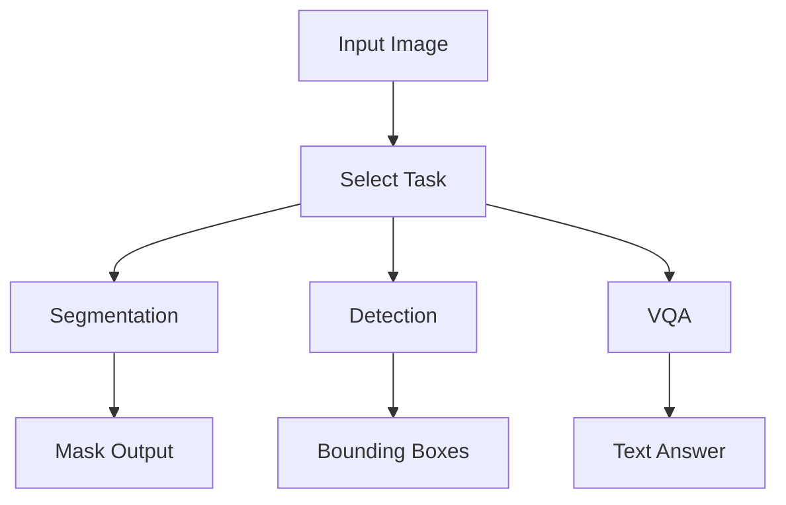

# 26-1 Deep Learning — Foundation Model Experiments

This repository explores multiple **foundation models from Hugging Face** across different computer vision tasks.
Each project was developed independently and later integrated into this unified repository.

---

## Overview

The goal of this project is to **experiment with real-world behavior of foundation models**, rather than only studying them theoretically.

We cover:

- Open-vocabulary object detection
- Point-based image segmentation
- Vision-language question answering

Each task is implemented as a separate module with its own pipeline and README.

---

## Project Structure

```bash
26-1_DEEP_LEARNING/
├─ open-vocabulary_detection/
├─ point-based_segmentation/
├─ vision_language_model/
└─ README.md
```

Each directory contains:

- Independent implementation
- Model-specific pipeline
- Detailed documentation (README)

---

## Models Used

| Task         | Model                        | Description                                |
| ------------ | ---------------------------- | ------------------------------------------ |
| Segmentation | SAM (Segment Anything Model) | Prompt-based segmentation using points     |
| Detection    | OWL-ViT                      | Open-vocabulary detection via text queries |
| VQA          | Qwen-VL                      | Vision-language reasoning model            |

---

## Tasks

### 1. Point-based Segmentation

Interactive segmentation using user-provided foreground/background points.

`point-based_segmentation/`

---

### 2. Open-Vocabulary Detection

Detect objects using natural language queries without predefined classes.

`open-vocabulary_detection/`

---

### 3. Vision-Language Model (VQA)

Answer questions about images using a multimodal large language model.

`vision_language_model/`

---

## Setup

Each subproject follows its own execution pipeline.

---

## Overall Pipeline



---

## Purpose

This project focuses on:

- Understanding how foundation models behave in practice
- Comparing different paradigms:
  - Prompt-based vision (SAM)
  - Language-driven detection (OWL-ViT)
  - Multimodal reasoning (Qwen-VL)

---

## Notes

- All experiments are reproducible
- Each module can be executed independently
- Designed for demonstration and analysis

---
