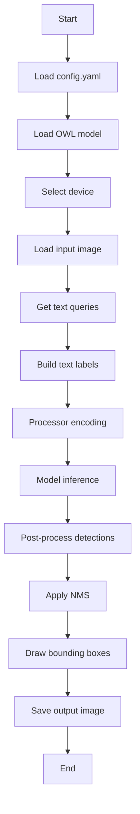

# README.md
## Open-Vocabulary Detection with OWLv2 / OWL-ViT

This project demonstrates **open-vocabulary object detection** using Hugging Face OWL-family models with a text-query interface.

Users provide:
- An input image
- Text queries (for example: `pen, laptop`)

The model then detects objects that match the given text prompts and returns bounding boxes with confidence scores.

---

## Features

- OWLv2 / OWL-ViT based open-vocabulary detection
- Text-query based inference (no fixed class list)
- Cross-platform support (Windows / Linux / macOS MPS)
- Automatic device selection:
  - CUDA
  - MPS
  - CPU fallback
- Visualization outputs:
  - Bounding boxes
  - Predicted labels
  - Confidence scores

---

## Project Structure

```bash
open-vocabulary_detection/
├─ configs/
│ └─ default.yaml
├─ checkpoints/
├─ data/
│ ├─ input/
│ └─ output/
├─ src/
│ ├─ main.py
│ ├─ inference.py
│ ├─ predictor.py
│ ├─ owl_wrapper/
│ │ └─ load_model.py
│ └─ utils/
│   ├─ config.py
│   ├─ device.py
│   ├─ image_io.py
│   ├─ text.py
│   └─ visualization.py
├─ scripts/
│ └─ download_checkpoint.py
├─ requirements.txt
└─ README.md
```

---

## Installation

### Install PyTorch (GPU / CPU / MPS)
#### Windows / Linux (CUDA 11.8 - GPU)
```bash
pip install torch torchvision torchaudio --index-url https://download.pytorch.org/whl/cu118
```
#### CPU Only
```bash
pip install torch torchvision torchaudio
```
#### macOS (Apple Silicon - MPS)
```bash
pip install torch torchvision
```

### Install requirements
```bash
pip install -r requirements.txt
```

#### Note
PyTorch should be installed separately depending on your system environment (CUDA / MPS / CPU).

---

## Download Model
```bash
python scripts/download_checkpoint.py --config configs/default.yaml
```
Hugging Face checkpoint is downloaded and cached locally
If needed, you can set HF_TOKEN for faster downloads and higher rate limits

---

## How to Run
### CLI Text Input
```bash
python src/main.py --config configs/default.yaml --text "pen, laptop"
```
### Interactive Text Input
```bash
python src/main.py --config configs/default.yaml
```
### Example input:
``` bash
pen, laptop
```

---

## Inputs
- Image
    - Stored in data/input/
    - Path is specified in configs/default.yaml
- Text Queries
    - Entered through CLI or interactive prompt

---

## Pipeline



---

## Outputs
- Saved in data/output/
    - result.jpg → detection result with bounding boxes and labels