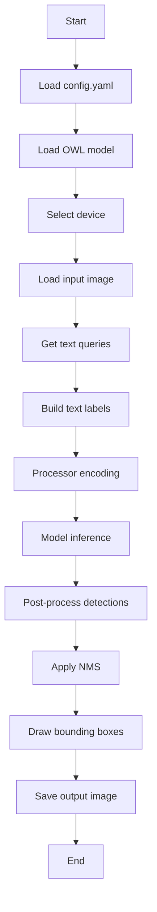

# README.md

## Open-Vocabulary Detection with OWLv2 / OWL-ViT

This project demonstrates **open-vocabulary object detection** using Hugging Face OWL-family models with a text-query interface.

Users provide:

- An input image
- Text queries (for example: `pen, laptop`)

The model then detects objects that match the given text prompts and returns bounding boxes with confidence scores.

---

## Features

- OWLv2 / OWL-ViT based open-vocabulary detection
- Text-query based inference (no fixed class list)
- Cross-platform support (Windows / Linux / macOS MPS)
- Automatic device selection:
  - CUDA
  - MPS
  - CPU fallback
- Visualization outputs:
  - Bounding boxes
  - Predicted labels
  - Confidence scores

---

## Project Structure

```bash
open-vocabulary_detection/
├─ configs/
│ └─ default.yaml
├─ checkpoints/
├─ data/
│ ├─ input/
│ └─ output/
├─ src/
│ ├─ main.py
│ ├─ inference.py
│ ├─ predictor.py
│ ├─ owl_wrapper/
│ │ └─ load_model.py
│ └─ utils/
│   ├─ config.py
│   ├─ device.py
│   ├─ image_io.py
│   ├─ text.py
│   └─ visualization.py
├─ scripts/
│ └─ download_checkpoint.py
├─ requirements.txt
└─ README.md
```

---

## Installation

### Install PyTorch (GPU / CPU / MPS)

#### Windows / Linux (CUDA 11.8 - GPU)

```bash
pip install torch torchvision torchaudio --index-url https://download.pytorch.org/whl/cu118
```

#### CPU Only

```bash
pip install torch torchvision torchaudio
```

#### macOS (Apple Silicon - MPS)

```bash
pip install torch torchvision
```

### Install requirements

```bash
pip install -r requirements.txt
```

#### Note

PyTorch should be installed separately depending on your system environment (CUDA / MPS / CPU).

---

## Download Model

```bash
python scripts/download_checkpoint.py --config configs/default.yaml
```

Hugging Face checkpoint is downloaded and cached locally
If needed, you can set HF_TOKEN for faster downloads and higher rate limits

---

## How to Run

### CLI Text Input

```bash
python src/main.py --config configs/default.yaml --text "pen, laptop"
```

### Interactive Text Input

```bash
python src/main.py --config configs/default.yaml
```

### Example input:

```bash
pen, laptop
```

---

## Inputs

- Image
  - Stored in data/input/
  - Path is specified in configs/default.yaml
- Text Queries
  - Entered through CLI or interactive prompt

---

## Code Roles

### `src/main.py`

Main entry point of the project.

Responsibilities:

- Load the YAML config file
- Receive text queries from CLI or interactive input
- Load the selected OWL-family model
- Run inference
- Visualize detection results
- Save the final output image

---

### `src/inference.py`

Core inference pipeline for open-vocabulary detection.

Responsibilities:

- Load and optionally resize the input image
- Prepare text labels for OWLv2 / OWL-ViT
- Run model inference
- Post-process model outputs
- Apply Non-Maximum Suppression (NMS)
- Return filtered detection results

---

### `src/predictor.py`

Handles user text input.

Responsibilities:

- Read text queries from the `--text` argument
- Fall back to interactive input when no CLI query is given
- Parse and normalize comma-separated text queries

---

### `src/owl_wrapper/load_model.py`

Loads the selected OWL-family model and processor.

Responsibilities:

- Select the correct model based on config
- Load OWLv2 or OWL-ViT from Hugging Face
- Move the model to the selected device
- Set the model to evaluation mode

---

### `src/utils/config.py`

Utility for loading configuration files.

Responsibilities:

- Read `configs/default.yaml`
- Return configuration values as a Python dictionary

---

### `src/utils/device.py`

Device selection utility.

Responsibilities:

- Automatically choose between CUDA, MPS, and CPU
- Validate requested device settings
- Provide safe fallback when a device is unavailable

---

### `src/utils/image_io.py`

Image input/output utility.

Responsibilities:

- Load input images
- Resize large images while preserving aspect ratio
- Save the final output image

---

### `src/utils/text.py`

Text preprocessing utility.

Responsibilities:

- Parse comma-separated query strings
- Convert raw text input into a clean query list

---

### `src/utils/visualization.py`

Visualization utility for detection outputs.

Responsibilities:

- Draw bounding boxes on the image
- Render predicted text labels
- Display confidence scores for each detection

---

### `scripts/download_checkpoint.py`

Utility script for downloading model checkpoints in advance.

Responsibilities:

- Load model information from config
- Download the selected OWLv2 / OWL-ViT checkpoint
- Cache the processor and model locally before inference

---

## Pipeline



---

## Outputs

- Saved in data/output/
  - result.jpg → detection result with bounding boxes and labels
