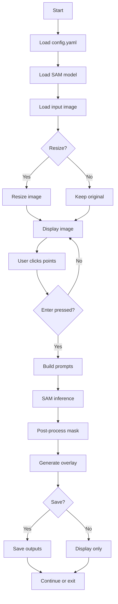

# README.md

## Point-based Segmentation with SAM

This project demonstrates **point-based image segmentation** using the Segment Anything Model (SAM) with an interactive interface.

Users can click on an image to provide:

- Foreground points (object)
- Background points (non-object)

The model then generates a segmentation mask based on these prompts.

---

## Features

- SAM-based point prompt segmentation
- Interactive mouse-based input (no manual coordinate typing)
- Cross-platform support (Windows / Linux / macOS MPS)
- Automatic resizing for large images
- Visualization outputs:
  - Prompt image (points)
  - Mask
  - Overlay
  - Combined panel

---

## Project Structure

```bash
point-based_segmentation/
├─ configs/
│ └─ default.yaml
├─ checkpoints/
├─ data/
│ ├─ input/
│ └─ output/
├─ src/
│ ├─ main.py
│ ├─ inference.py
│ ├─ predictor.py
│ ├─ sam_wrapper/
│ │ └─ load_model.py
│ └─ utils/
│   ├─ device.py
│   ├─ image_io.py
│   ├─ points.py
│   └─ visualization.py
├─ scripts/
│ └─ download_checkpoint.py
├─ requirements.txt
└─ README.md
```

---

## Installation

### Install PyTorch (GPU / CPU / MPS)

#### Windows / Linux (CUDA 11.8 - GPU)

```bash
pip install torch torchvision torchaudio --index-url https://download.pytorch.org/whl/cu118
```

#### CPU Only

```bash
pip install torch torchvision torchaudio
```

#### macOS (Apple Silicon - MPS)

```bash
pip install torch torchvision
```

### Install requirements

```bash
pip install -r requirements.txt
```

#### Note

PyTorch should be installed separately depending on your system environment (CUDA / MPS / CPU).

---

## Download Model

```bash
python scripts/download_checkpoint.py
```

- No Hugging Face token required
- Model is stored locally in checkpoints/

---

## How to Run (Interactive Mode)

```bash
python -m src.main --config configs/default.yaml
```

---

## Controls

```bash
Action	Key / Mouse
Add foreground point	Left click
Add background point	Right click
Run segmentation	Enter
Reset points	r
Save results	s
Exit	q
```

---

---

## Code Overview

This project is modularized into several components, each responsible for a specific part of the segmentation pipeline.

### `main.py`

- Entry point of the project
- Parses command-line arguments
- Switches between interactive mode and inference mode

### `interactive.py`

- Provides an interactive UI using OpenCV
- Handles mouse input for foreground/background points
- Controls the segmentation loop and user interaction

### `inference.py`

- Runs segmentation using predefined points from config
- Handles the full pipeline: model → preprocessing → inference → saving outputs

### `predictor.py`

- Core SAM inference module
- Converts point prompts into model inputs
- Runs model inference and post-processes masks
- Returns final binary mask and confidence score

### `sam_wrapper/load_model.py`

- Loads SAM model and processor from local checkpoint
- Handles device selection (CPU / CUDA / MPS)

### `utils/device.py`

- Automatically selects available computation device

### `utils/image_io.py`

- Handles image loading and resizing
- Ensures directories exist

### `utils/points.py`

- Validates point inputs
- Scales points when resizing is applied
- Converts points into SAM-compatible format

### `utils/visualization.py`

- Generates output visualizations:
  - Mask
  - Prompt image
  - Overlay
  - Combined panel

---

## Pipeline



---

## Outputs

- Saved in data/output/:
  - \*\_mask.png → binary mask <br>
  - \*\_prompt.png → points visualization <br>
  - \*\_overlay.png → segmentation overlay <br>
  - \*\_panel.png → combined visualization <br>
