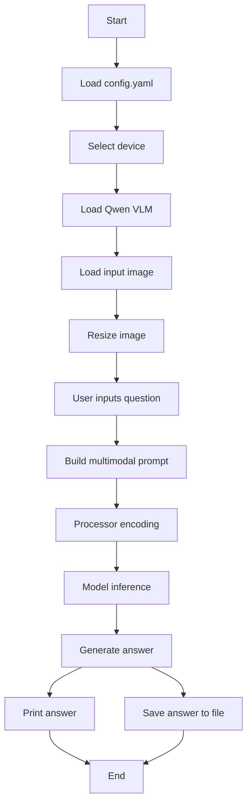

# README.md

## Vision-Language Model with Qwen (VQA)

This project demonstrates **vision-language understanding** using a Qwen-based Vision-Language Model (VLM).

Users provide:

- An input image
- A natural language question

The model then interprets the image and generates a **textual answer grounded in visual content**.

---

## Features

- Qwen2-VL based vision-language inference
- Natural language question answering (VQA)
- Cross-platform support (Windows / Linux / macOS MPS)
- Automatic device selection:
  - CUDA
  - MPS
  - CPU fallback

---

## Project Structure

```bash
vision_language_model/
├─ configs/
│ └─ default.yaml
├─ checkpoints/
├─ data/
│ ├─ input/
│ └─ output/
├─ src/
│ ├─ main.py
│ ├─ inference.py
│ ├─ predictor.py
│ ├─ qwen_wrapper/
│ │ └─ load_model.py
│ └─ utils/
│   ├─ config.py
│   ├─ device.py
│   ├─ image_io.py
│   ├─ text.py
│   └─ visualization.py
├─ scripts/
├─ .gitignore
├─ requirements.txt
└─ README.md
```

---

## Installation

### Install PyTorch (GPU / CPU / MPS)

#### Windows / Linux (CUDA 11.8 - GPU)

```bash
pip install torch torchvision torchaudio --index-url https://download.pytorch.org/whl/cu118
```

#### CPU Only

```bash
pip install torch torchvision torchaudio
```

#### macOS (Apple Silicon - MPS)

```bash
pip install torch torchvision
```

#### Install requirements

```bash
pip install -r requirements.txt
```

#### Note

PyTorch should be installed separately depending on your system environment (CUDA / MPS / CPU).

---

### Download Model

No manual download is required.

The Hugging Face model will be automatically downloaded and cached during the first run.

If needed, you can set HF_TOKEN for faster downloads and higher rate limits.

---

## How to Run

### Run the program

```bash
python -m src.main
```

### Interactive Question Input

```bash
Question > What is happening in this image?
```

### Inputs

- Image
  - Stored in data/input/
  - Path is specified in configs/default.yaml
- Question
  - Entered interactively through CLI

---

## Pipline



---

## Outputs

- Saved in data/output/
  - result.txt → generated answer
